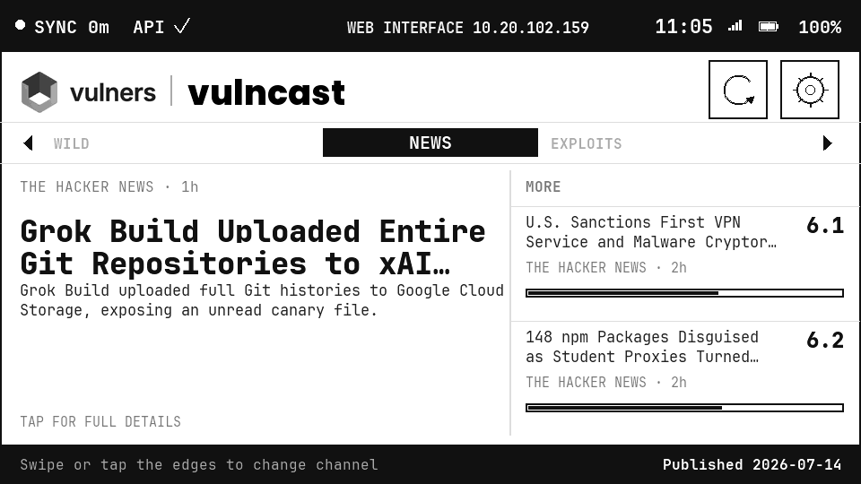
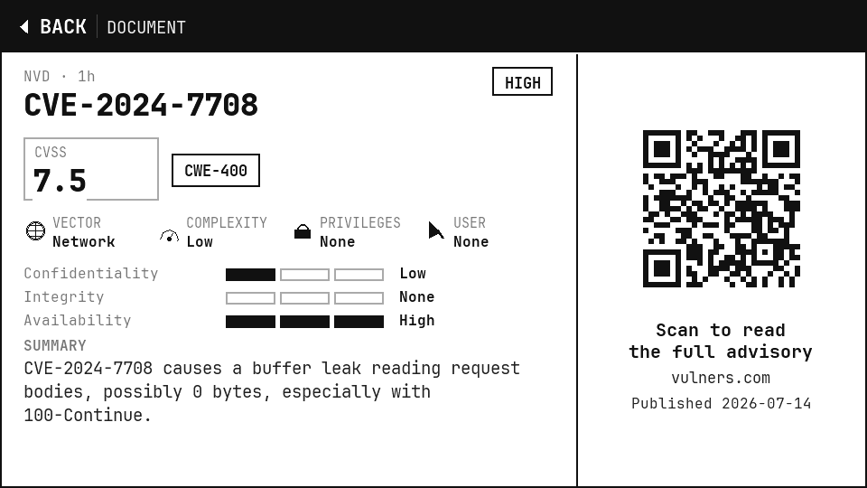
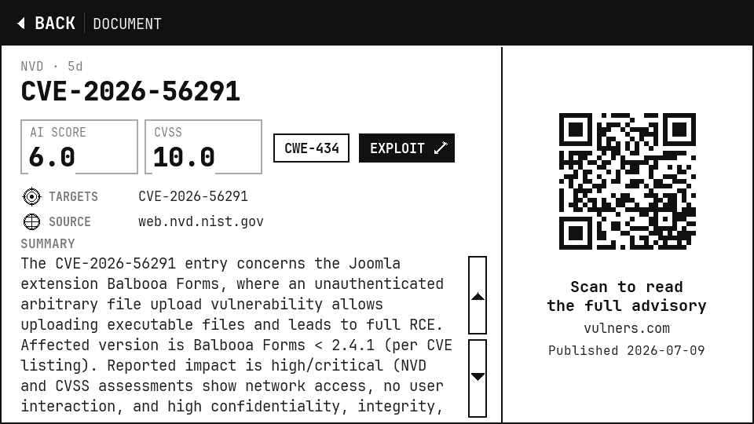
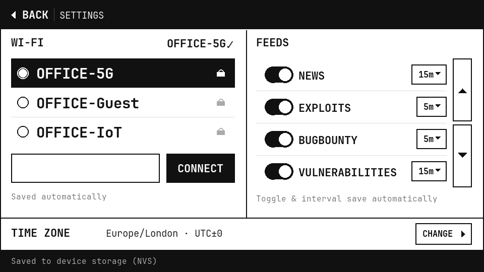
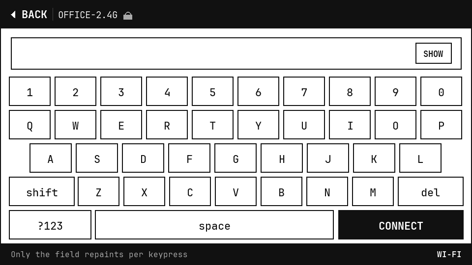
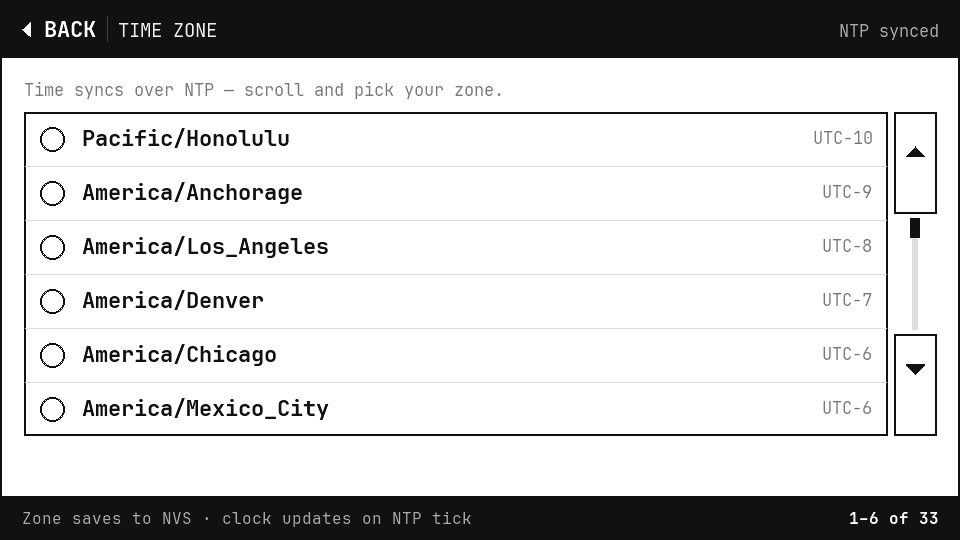
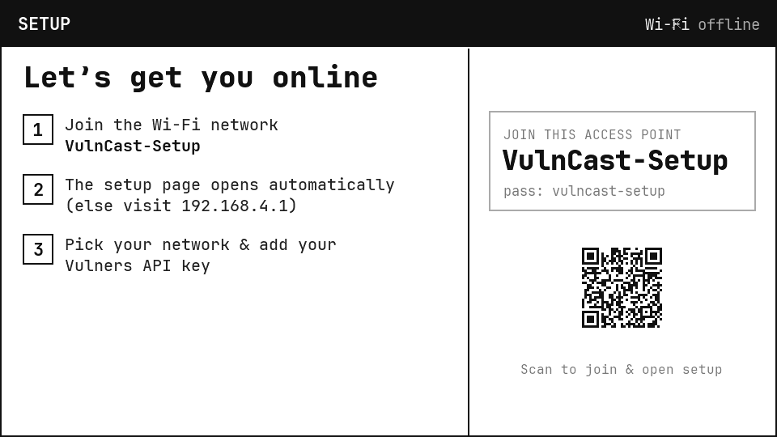
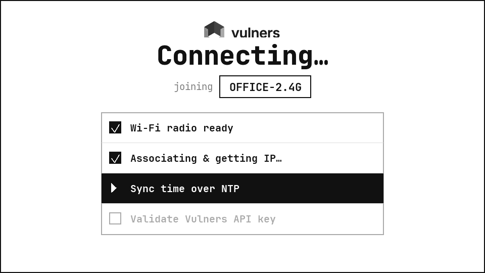
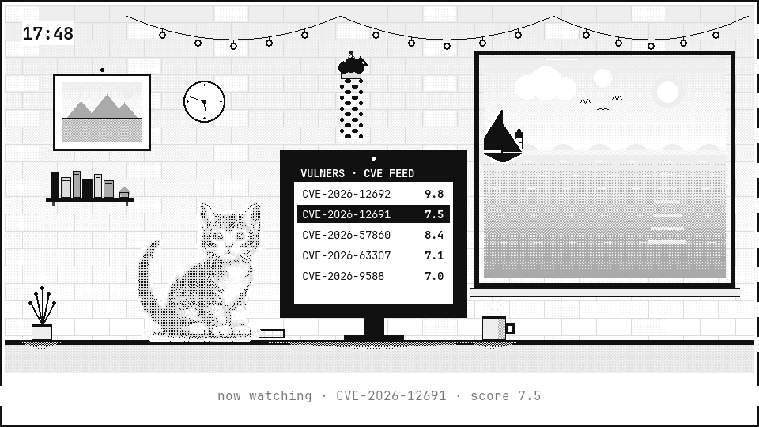

<div align="center">

# ⚡ VulnCast

## Feels like 9.8.

#### *The internet's security forecast on your desk.*

A **~$40** ESP32-S3 e-paper gadget that pulls live CVE / exploit / bug-bounty / infosec-news feeds
straight from the [Vulners API](https://vulners.com/) and forecasts the threat "weather" — so you can
stop refreshing notifications, mail, and JSON for vulnerability alerts. It watches, so you don't have to.
**Fully on-device. No backend, no server.**

<br>

[](LICENSE)
[](boards/T5-ePaper-S3.json)
[](https://platformio.org/)
[](#-hardware)
[](https://vulners.com/)
[](https://github.com/vulnersCom/VulnCast/releases)

<br>



<sub>The dashboard: a featured champion + candidate feed, with sync age, API status, and the live web-interface IP in the top bar.</sub>

<br><br>

### ⚡ [Flash it in your browser →](https://vulnerscom.github.io/VulnCast/)

<sub>No build, no esptool — grab the board, click once, done.</sub>

</div>

---

## ✨ Highlights

- 🛰️ **Direct-to-API, on-device.** Per-channel Lucene search + on-demand by-id detail, straight from
  firmware with an `X-Api-Key` header. No proxy, no companion app.
- 📡 **Rotating channels.** News · Exploits · Bug Bounty · Vulnerabilities out of the box — plus any
  custom channel (just a Lucene query + refresh interval).
- 🧬 **Human-first document view.** CVSS decoded into exploitability icons + C/I/A impact bars, CWE /
  CISA-KEV chips, an **exploit count**, a scrollable summary, and a scannable QR deep-link — the layout
  adapts per record type (CVE vs exploit vs advisory).
- 🖥️ **Touch UI.** Dashboard, document, settings, on-screen keyboard, refresh-interval and time-zone
  pickers, plus firmware-update and out-of-credits screens — GT911 capacitive touch, saved to NVS.
- 😌 **Chill mode.** A lofi grayscale screensaver — a cat at a desk reading the live CVE feed, a
  drifting sailboat out a seaside window, and real-time clocks — kept flash-free on e-paper. Tap the
  Vulners logo five times to enter; one tap to leave.
- 🪙 **API credits, in view.** Your remaining Vulners API credits sit in the dashboard footer, with a
  full-screen heads-up (and a QR to upgrade) the moment they run out.
- 📶 **Zero-config Wi-Fi.** WPA2/WPA3, multi-network store, captive-portal provisioning, and a runtime
  fallback to the setup AP if the network disappears.
- 🎞️ **Flash-free e-paper.** A damage-tracking compositor repaints only the changed rows (2-bit partial
  update) — no full-screen blink on every tick.
- 🔄 **Signed over-the-air updates.** Checks GitHub hourly — or on demand from **Settings → Check for
  updates** — verifies an **Ed25519 signature** on the release manifest, installs on your confirmation,
  and **rolls back automatically** if the new build doesn't boot cleanly. Plus a **factory-reset**
  button that wipes the device back to out-of-box state.

---

## 📸 Screens

<table>
  <tr>
    <td align="center"><br><sub><b>Dashboard</b></sub></td>
    <td align="center"><br><sub><b>CVE document</b> — CVSS vector + C/I/A bars</sub></td>
  </tr>
  <tr>
    <td align="center"><br><sub><b>Exploit document</b> — archetype-adaptive</sub></td>
    <td align="center"><br><sub><b>Settings</b> — Wi-Fi, feeds, time zone</sub></td>
  </tr>
  <tr>
    <td align="center"><br><sub><b>On-screen keyboard</b></sub></td>
    <td align="center"><br><sub><b>Time-zone picker</b></sub></td>
  </tr>
  <tr>
    <td align="center"><br><sub><b>Captive-portal setup</b></sub></td>
    <td align="center"><br><sub><b>Connecting</b></sub></td>
  </tr>
  <tr>
    <td align="center" colspan="2"><br><sub><b>Chill mode</b> — a lofi screensaver: a cat reading the live CVE feed, a seaside window, real-time clocks (tap the Vulners logo 5×)</sub></td>
  </tr>
</table>

<div align="center"><b><a href="images/GALLERY.md">→ Full gallery (all 9 screens)</a></b></div>

---

## 🛠 Hardware

- **Board:** [LilyGo T5 4.7" E-Paper S3](https://lilygo.cc/products/t5-4-7-inch-e-paper-v2-3) **V2.4**
  (ESP32-S3-WROOM-1-N16R8 — 16 MB flash, 8 MB OPI PSRAM, 240 MHz, dual-app OTA partitions). ~$40 —
  pick the **Touch** variant.
- **Panel:** 960×540 ED047TC1 e-paper (rendered 2-bit) with a GT911 capacitive touch controller.
- ESP32-S3 is **2.4 GHz Wi-Fi only**. Native USB may re-enumerate on reset — that is normal.

## 🧩 Software stack (fully on-device, no backend)

- **Platform:** [pioarduino](https://github.com/pioarduino/platform-espressif32) — Arduino-ESP32 3.x /
  ESP-IDF 5.5.
- **Display:** [FastEPD](https://github.com/bitbank2/FastEPD) drives the V2.4 shift-register panel;
  [epdiy](https://github.com/vroland/epdiy) 2.0 is the software rasterizer. A 960×540 4bpp framebuffer
  lives in PSRAM; a damage-tracking compositor repaints only the changed rows (flash-free 2-bit partial
  update) — a full flash runs only on a page/data change and a periodic de-ghost.
- **Data:** the Vulners REST API over HTTPS, parsed with ArduinoJson filters using precise dot-notation
  field selection, so even multi-MB documents stay small.
- **Wi-Fi:** WPA2/WPA3, multi-network NVS store, captive-portal provisioning (`vulncast.local`).
- **Update:** USB, password-protected OTA (ArduinoOTA), and signed background auto-update from GitHub
  with automatic rollback — see [Firmware updates](#-firmware-updates--rollback) below.

## 🔄 Firmware updates & rollback

Every ~hour the device anonymously fetches a small **signed manifest** from GitHub Pages
(`update.json`: version, image URL, size, SHA-256, and an Ed25519 signature). It verifies the
signature against a **public key baked into the firmware**, and if a newer version is offered it shows
an update screen — **Update now** or **Try again tomorrow**. On confirmation it streams the app image,
checks the SHA-256 against the signed value, and writes it to the spare OTA slot.

The new build then boots in a **pending-verify** state: it must reach a live UI without crashing, or
the bootloader **rolls back to the previous version automatically** (with an on-device "update failed"
screen). A three-strikes boot counter backstops a hard wedge. TLS to GitHub is validated against the
embedded CA bundle, but the Ed25519 signature is the real integrity gate — a compromised CDN, cert, or
TLS link still cannot ship firmware the device will run. **No credentials are baked in**; the private
signing key lives only on the release machine.

**Configuration (for forks — override in `platformio.ini` `build_flags`, defaults are secure):**

| Flag | Default | Effect |
|------|---------|--------|
| `VULNCAST_UPDATE_MANIFEST_URL` | our GitHub Pages `update.json` | Point auto-update at your own host. |
| `VULNCAST_OTA_REQUIRE_SIGNATURE` | `1` | `0` runs **signature-free** — for a fork that self-hosts updates without managing a signing key (integrity then rests on TLS + the manifest SHA-256). |
| `VULNCAST_OTA_CHECK_INTERVAL_MS` | `3600000` | How often to check. |

To cut a signed release: build the credential-free **app image** (`firmware.bin`, not the `.factory.bin`)
and the browser-flasher **factory image**, drop both under `flasher/firmware/`, then
`python3 scripts/sign_manifest.py --version X.Y.Z --url https://vulnerscom.github.io/VulnCast/firmware/vulncast-X.Y.Z-app.bin --bin flasher/firmware/vulncast-X.Y.Z-app.bin --out flasher/update.json`
and push — GitHub Pages serves `update.json` + the app image (single origin, no redirect). The private
key is read from `~/.vulncast/` (generated once by `scripts/gen_update_key.py`) and is never committed.

## ⚡ Flash it — no build required

The easiest path: **[flash from your browser →](https://vulnerscom.github.io/VulnCast/)**. Plug the
board in over USB-C, click once, and [ESP Web Tools](https://esphome.github.io/esp-web-tools/) writes
the firmware over Web Serial — no toolchain, no compiler. Needs desktop **Chrome / Edge / Opera**.

The flasher (page + manifest + firmware) is self-hosted from this repo under
[`flasher/`](flasher/) and published to GitHub Pages. The shipped binary is **credential-free** — you
enter Wi-Fi and your Vulners API key on the device via the captive portal; nothing is baked in.

Prefer the CLI? Flash the same image with [esptool](https://docs.espressif.com/projects/esptool/):

```bash
esptool.py --chip esp32s3 write_flash 0x0 flasher/firmware/vulncast-1.1.0-esp32s3.factory.bin
```

**Verify the image first** — SHA-256 of `vulncast-1.1.0-esp32s3.factory.bin`:

```
3de436ff6037ed1a17f6917519f11a1e14c488c26f9455ce82fe489eb1b91626
```

## 🚀 Build & flash (from source)

Requires [PlatformIO Core](https://platformio.org/) (≥ 6.1.18) and a
[Vulners API key](https://docs.vulners.com/docs/quickstart/authentication/).

```bash
cp secrets.yaml.example secrets.yaml   # fill vulners_api_key (+ optional wifi seed / ota_password)
pio run                                # compile (generates include/secrets.h from secrets.yaml)
pio run -t upload                      # flash over USB
pio device monitor                     # serial logs @115200
```

On first boot with no known Wi-Fi in range, the device raises a `VulnCast-Setup` hotspot — join it,
open <http://192.168.4.1>, pick your network and enter your API key. Everything (Wi-Fi, key, channels,
time zone) is stored in NVS; `secrets.yaml` only seeds a first-boot fallback and is never committed.

## 🔌 Debug console

An always-on UART console runs on its own core-0 task (it answers even if the UI loop is busy). Drive
it from the host with `tools/console.py` (`pip install pyserial pillow`):

```bash
python tools/console.py info            # device state (wifi, api key, channels, heap)
python tools/console.py dump fb.png     # capture the exact e-paper framebuffer as a PNG
python tools/console.py press featured  # inject a touch at a named hit-box
python tools/console.py reboot
```

## 📂 Repository layout

| Path | What |
|------|------|
| `src/` | Firmware: orchestration, touch UI + chill-mode screensaver, drawing toolkit, Vulners client, channels, Wi-Fi, timekeeper, config, updater, web UI. |
| `boards/T5-ePaper-S3.json` | Board definition (vendored from LilyGo) for the exact V2.4 module. |
| `scripts/gen_secrets.py` | Pre-build hook: generates `include/secrets.h` from `secrets.yaml`. |
| `tools/` | Host tooling: serial console, framebuffer dump, font/asset generation. |

## 🤝 Contributing & security

- Contributor guide → [CONTRIBUTING.md](CONTRIBUTING.md)
- Security policy & reporting → [SECURITY.md](SECURITY.md)

## 🙏 Credits

Fonts: **[JetBrains Mono](https://www.jetbrains.com/lp/mono/)** (OFL 1.1). Libraries:
[FastEPD](https://github.com/bitbank2/FastEPD) ·
[epdiy](https://github.com/vroland/epdiy) ·
[ArduinoJson](https://arduinojson.org/) ·
[SensorLib](https://github.com/lewisxhe/SensorLib) ·
[Button2](https://github.com/LennartHennigs/Button2) ·
[QRCode](https://github.com/ricmoo/QRCode).
Full attribution in [THIRD_PARTY_NOTICES.md](THIRD_PARTY_NOTICES.md).

A [Vulners Inc.](https://vulners.com/) project, powered by the Vulners API. Not affiliated with or
endorsed by LilyGo.

## 📜 License

[MIT](LICENSE) © 2026 Vulners Inc.

---

<div align="center">

**Built with ⚡ by [Vulners](https://vulners.com/)**

<sub>

`#ESP32` `#ESP32S3` `#ePaper` `#eInk` `#LilyGo` `#PlatformIO` `#Arduino` `#Vulners` `#CyberSecurity`
`#InfoSec` `#VulnerabilityManagement` `#CVE` `#ThreatIntel` `#IoT` `#EmbeddedSystems` `#DevSecOps`

</sub>

</div>
