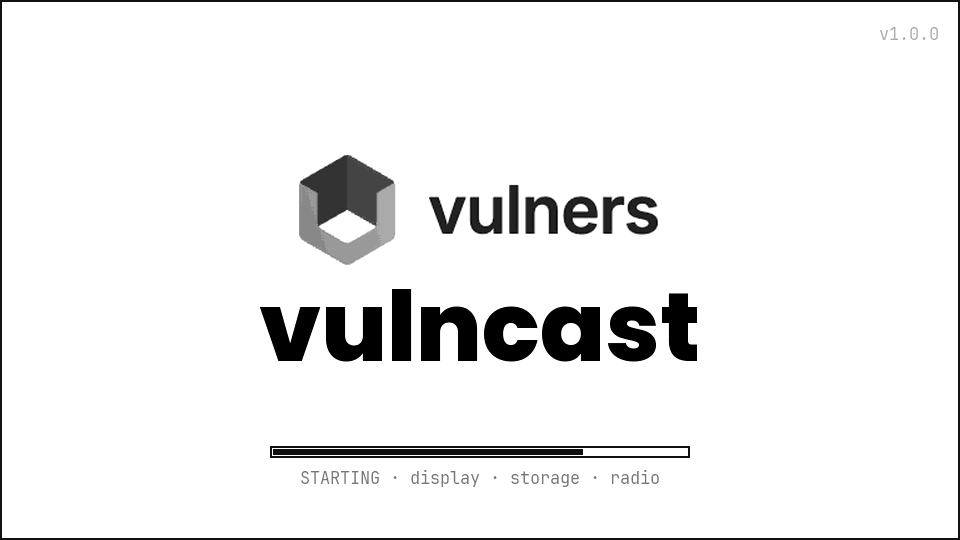
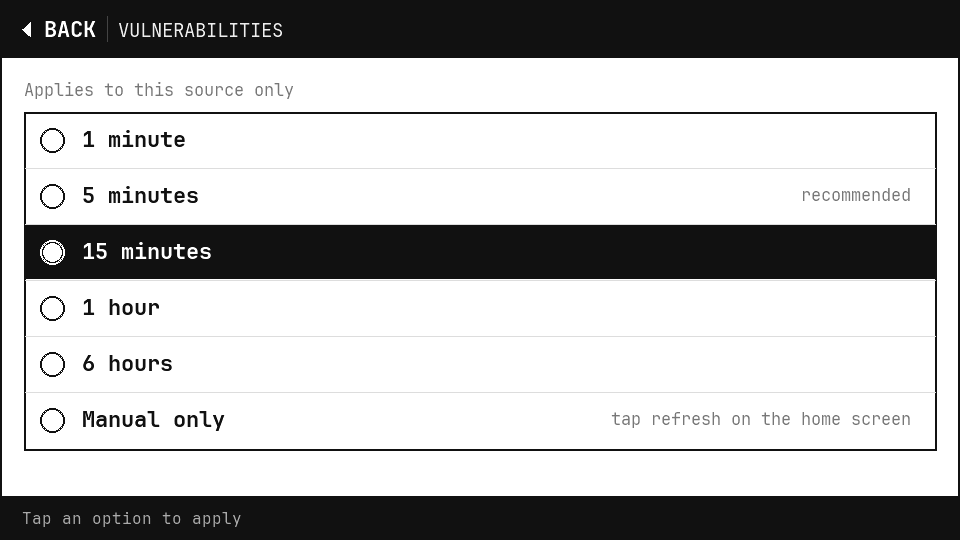

# ⚡ VulnCast — screen gallery

The full on-device UI, captured from the live 960×540 e-paper framebuffer. Wi-Fi names shown are
placeholders.

**[← Back to README](../README.md)**

---

## Boot

Splash with staged init progress (display · storage · radio) and the firmware version.

## Connecting

Non-blocking join with live per-step progress (radio → IP → NTP → API key); the UI never blocks.

## Setup (captive portal)

First boot with no known Wi-Fi (or after a sustained reconnect failure) raises the `VulnCast-Setup`
WPA2 hotspot with a Wi-Fi QR and a web provisioning page.

## Dashboard

Rotating channels: a featured champion (severity, metrics, summary) plus a candidate feed. The status
bar shows sync age, Vulners API status, and the live web-interface IP.

## Document — CVE

Full record for a vulnerability: CVSS + AI-score tiles, CWE chip, the CVSS vector decoded into
exploitability icons and C/I/A impact bars, a scrollable summary, and a QR deep-link to vulners.com.

## Document — exploit

The document view adapts to the record type: an exploit shows TARGETS / SOURCE facts and an EXPLOIT
tag instead of the CVSS vector — same layout engine, archetype-driven content.

## Settings

On-device management: Wi-Fi networks, per-channel enable + refresh interval, and the time zone — all
saved to NVS. (Wi-Fi names redacted.)

## Wi-Fi keyboard

On-screen keyboard for the Wi-Fi password, with a symbol layer and a show-password toggle; only the
field repaints per keypress (no flashing).

## Refresh-interval picker

Per-channel update cadence, chosen from presets.

## Time-zone picker

Linux-installer-style scrollable IANA zone list with UTC offsets; time syncs over NTP.
